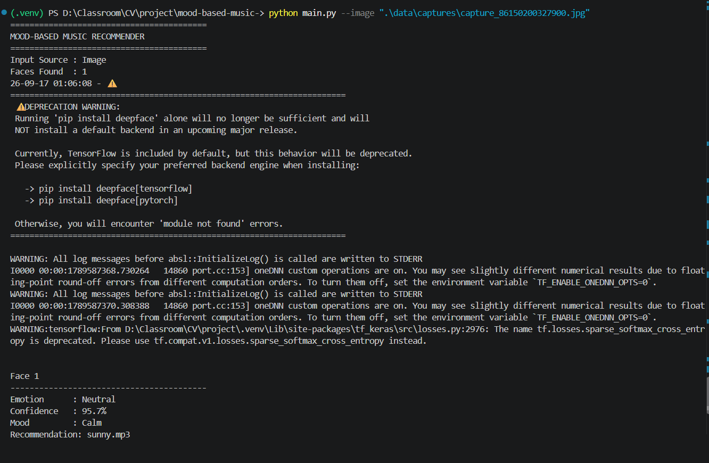

# Mood-Based Music Recommendation Using Facial Emotion Recognition

## 1. Project Overview

This Computer Vision project detects faces from an image or webcam, estimates facial emotion with DeepFace, maps the result to a broader mood, and recommends legally usable local music. Webcam mode automatically plays a recommended track when the smoothed mood changes. Image-mode playback is optional through `--play`. The project preserves the original local Pygame playback workflow while adding a testable CLI architecture.

## 2. Problem Statement

Choosing music manually to match a current mood can be inconvenient. A facial-expression signal can provide a lightweight, probabilistic input for a local recommendation workflow.

## 3. Objectives

- Detect one or more faces and preprocess them.
- Estimate emotion and display the model confidence.
- Map emotion to a configurable mood.
- Recommend and optionally play local audio.
- Keep analysis history and calculate a session summary.
- Provide image, webcam, and terminal workflows.

## 4. Features

Facial detection, DeepFace emotion recognition, confidence thresholding, mood mapping, image mode, webcam mode with frame skipping and smoothing, local recommendation/playback, history, summary statistics, CLI, logging, and pytest tests.

## 5. Computer Vision Pipeline

`Input -> Face Detection -> Preprocessing -> Emotion Recognition -> Classification -> Mood Mapping -> Recommendation -> Optional Playback`

The webcam path analyzes every configurable `FRAME_SKIP` frame, not every frame. Displayed webcam emotion uses a small, transparent majority-vote smoothing window.

## 6. Technologies

Python 3.11, OpenCV, DeepFace, TensorFlow, tf-keras, Pygame, and pytest.

## 7. Project Structure

```text
main.py                 CLI entry point
src/                    Modular application components
tests/                  Deterministic unit tests
data/                   Mapping and generated history/captures
music/                  User-provided mood-organized audio
models/                 Model/cache documentation only
docs/                   Architecture, UML, workflow, and report outline
screenshots/            Submission screenshot guidance
project/music/          Original flat music library retained for compatibility
project/project.py      Legacy wrapper
```

## 8. Installation

```powershell
git clone https://github.com/GSAnuj/mood-based-music-.git
cd mood-based-music-
python -m venv .venv
.venv\Scripts\activate
python -m pip install --upgrade pip
pip install -r requirements.txt
```

## 9. Running the Project

```powershell
python main.py --help
python main.py --image path/to/image.jpg
python main.py --image path/to/image.jpg --play
python main.py --webcam
python main.py --history
python main.py --summary
python main.py --version
```

Webcam mode automatically recommends and plays a local track when the smoothed mood changes. Add `--play` to image mode to play its recommendation. Common errors such as missing images, unavailable cameras, empty history, and absent audio are reported as friendly messages.

## 10. Music Setup

The current repository uses the compatibility fallback because `music/` contains no audio files. The four existing local tracks are stored directly under `project/music/`: `actionable.mp3`, `floatinggarden.mp3`, `silentsuspicions.mp3`, and `sunny.mp3`. When no supported audio exists anywhere under `music/`, the recommender discovers these four flat files and selects from them for any mapped mood. Do not commit copyrighted audio without permission.

To use a separate local library, add legally usable `.mp3`, `.wav`, or `.ogg` files under `music/<mood>/`, for example `music/calm/track.mp3`. When the requested mood folder exists and contains supported audio, the recommender selects from that folder. The compatibility fallback is enabled only when `music/` contains no supported audio anywhere. If `music/` contains audio but the requested mood folder does not contain any tracks, the recommender returns no recommendation; it does not fall back to `project/music/` in that case.

## 11. Model Information

DeepFace supplies pre-trained facial emotion analysis. The application does not train a model and does not claim ownership of third-party model weights. Resources may be downloaded or cached by DeepFace on first use.

## 12. Dataset / Input Information

This project uses local images and live webcam frames as inputs. `sample_images/` is reserved for legally usable demonstration images; it currently contains instructions only, not an example image. It is not a claimed training dataset. No project-specific training dataset is included.

## 13. Testing

Run `pytest`. Tests cover mappings, validation, music discovery and repetition avoidance, history persistence and summaries, and repository-relative configuration. They do not require a webcam or DeepFace model inference.

## 14. Limitations

Lighting, occlusion, camera quality, multiple faces, model dependency, and CPU inference speed can affect results. Facial emotion recognition is probabilistic and culturally/contextually limited; it is not a definitive measurement of a person’s internal emotional state. The minimum confidence threshold is an application display rule, not an accuracy guarantee.

## 15. Future Enhancements

Personalized preferences, playlist learning, richer recommendation strategies, improved temporal smoothing, a more robust detector, and mobile deployment are possible extensions.

## 16. Academic Disclaimer

Predicted facial emotion should be treated as an uncertain computer-vision estimate, not as a diagnosis or definitive statement about a person’s feelings.

## Demo

Screenshots have not been added yet. Capture real screenshots after running the application:




## References

- [Python](https://docs.python.org/3/)
- [OpenCV](https://docs.opencv.org/)
- [DeepFace](https://github.com/serengil/deepface)
- [TensorFlow](https://www.tensorflow.org/api_docs)
- [Pygame](https://www.pygame.org/docs/)
- [pytest](https://docs.pytest.org/)

