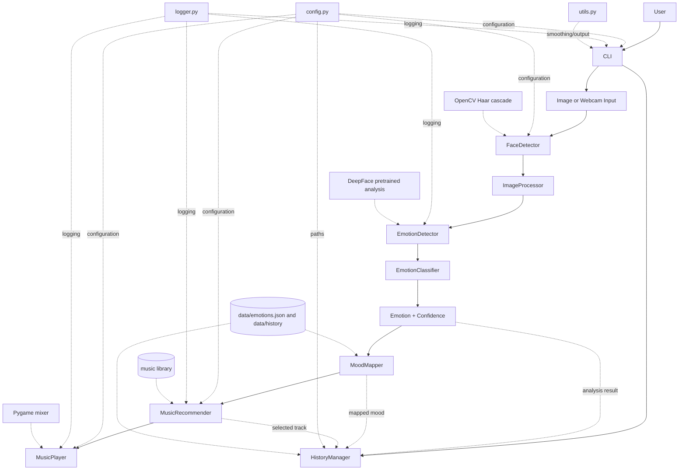

# Architecture

The CLI coordinates image and webcam workflows while the modules own separate responsibilities. Webcam mode applies frame skipping and temporal smoothing, uses the largest detected face as the primary listener for mood-change actions, and handles `q`, `p`, `m`, and `s` controls. Webcam playback is automatic on a smoothed mood change; image playback is optional with `--play`.
