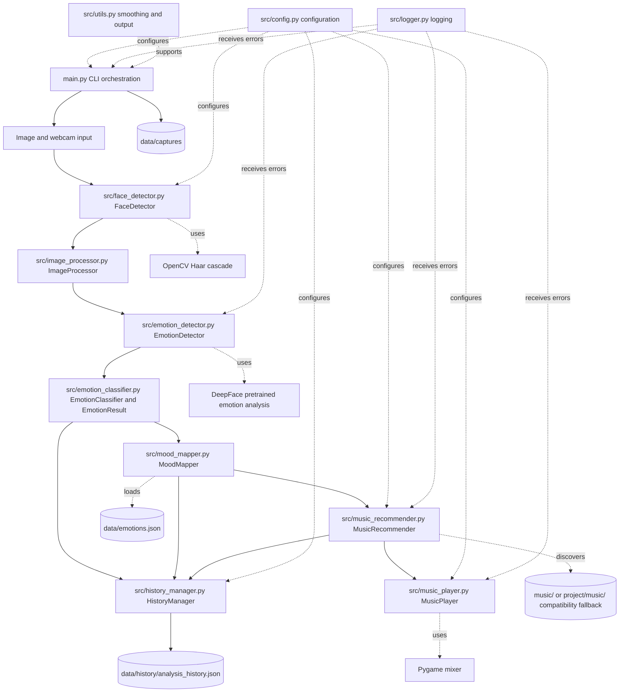

# Component Diagram

Image mode loads one image and optionally plays its recommendation with `--play`. Webcam mode reads frames continuously, skips frames according to `FRAME_SKIP`, smooths recent emotion predictions, uses the largest face as the primary listener for mood-change actions, and processes `q`, `p`, `m`, and `s` controls in the focused OpenCV window. Webcam playback is automatic when a new smoothed mood is selected.
