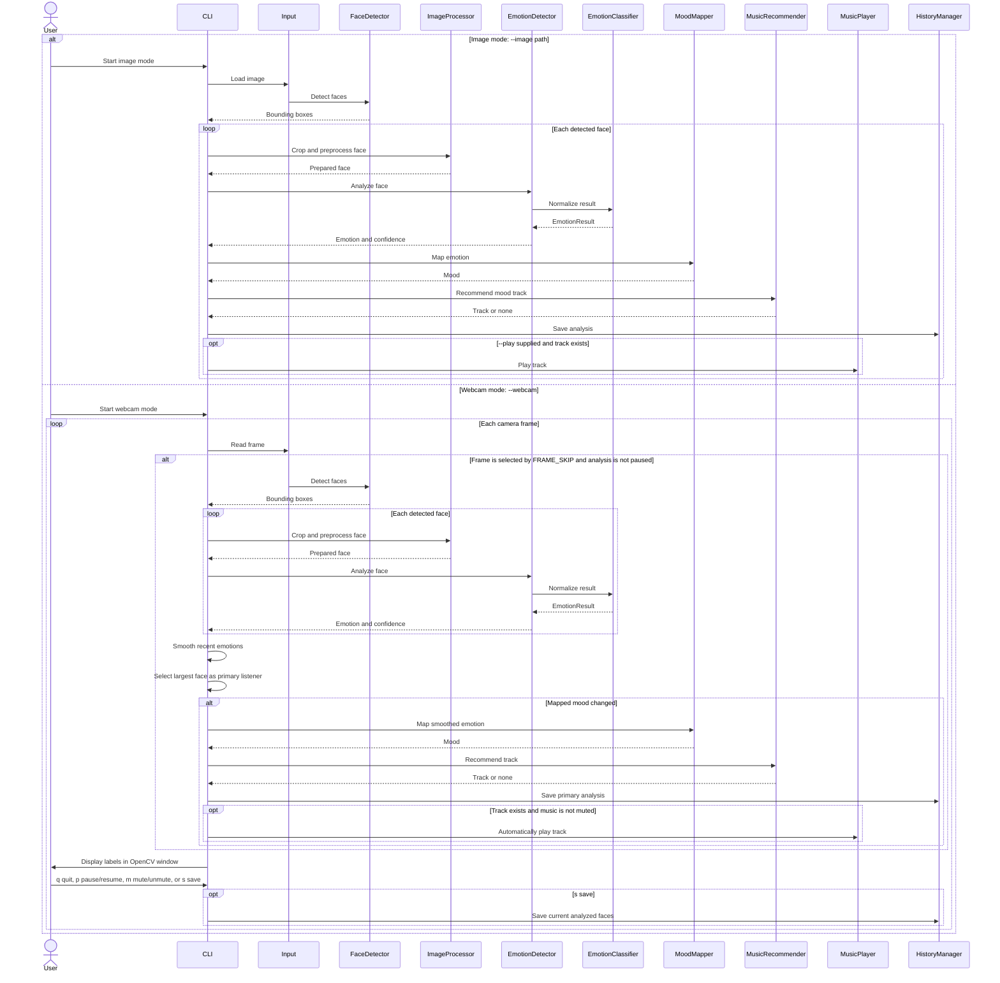

# Sequence

```mermaid
sequenceDiagram
 actor User
 participant CLI
 participant Input
 participant Face as FaceDetector
 participant Process as ImageProcessor
 participant Emotion as EmotionDetector
 participant Classifier as EmotionClassifier
 participant Mood as MoodMapper
 participant Rec as MusicRecommender
 participant Player as MusicPlayer
 participant History as HistoryManager
 alt Image mode: --image path
  User->>CLI: Start image mode
  CLI->>Input: Load image
  Input->>Face: Detect faces
  Face-->>CLI: Bounding boxes
  loop Each detected face
   CLI->>Process: Crop and preprocess face
   Process-->>CLI: Prepared face
   CLI->>Emotion: Analyze face
   Emotion->>Classifier: Normalize result
   Classifier-->>Emotion: EmotionResult
   Emotion-->>CLI: Emotion and confidence
   CLI->>Mood: Map emotion
   Mood-->>CLI: Mood
   CLI->>Rec: Recommend mood track
   Rec-->>CLI: Track or none
   CLI->>History: Save analysis
   opt --play supplied and track exists
    CLI->>Player: Play track
   end
  end
 else Webcam mode: --webcam
  User->>CLI: Start webcam mode
  loop Each camera frame
   CLI->>Input: Read frame
   alt Frame is selected by FRAME_SKIP and analysis is not paused
    Input->>Face: Detect faces
    Face-->>CLI: Bounding boxes
    loop Each detected face
     CLI->>Process: Crop and preprocess face
     Process-->>CLI: Prepared face
     CLI->>Emotion: Analyze face
     Emotion->>Classifier: Normalize result
     Classifier-->>Emotion: EmotionResult
     Emotion-->>CLI: Emotion and confidence
    end
    CLI->>CLI: Smooth recent emotions
    CLI->>CLI: Select largest face as primary listener
    alt Mapped mood changed
     CLI->>Mood: Map smoothed emotion
     Mood-->>CLI: Mood
     CLI->>Rec: Recommend track
     Rec-->>CLI: Track or none
     CLI->>History: Save primary analysis
     opt Track exists and music is not muted
      CLI->>Player: Automatically play track
     end
    end
   end
   CLI->>User: Display labels in OpenCV window
   User->>CLI: q quit, p pause/resume, m mute/unmute, or s save
   opt s save
    CLI->>History: Save current analyzed faces
   end
  end
 end
```

The CLI also supports `--history`, `--summary`, and `--version`; those commands do not run the computer-vision pipeline.
