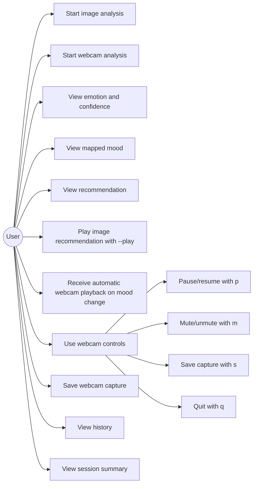

# Use Cases

Image analysis accepts a local image path. Webcam analysis continuously displays detected faces, emotion, confidence, and mood in the OpenCV window. The largest detected face is used as the primary listener for mood-change recommendation and playback; a saved capture records the current analyzed faces.
