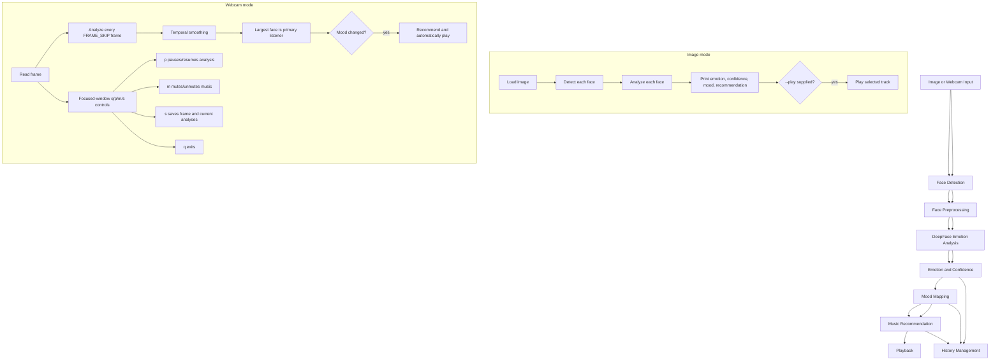

# Workflow

The shared pipeline is face detection -> preprocessing -> emotion analysis -> confidence -> mood mapping -> recommendation -> playback -> history. Image mode processes a provided file once. Webcam mode continues in a loop, displays labels in the OpenCV window, skips frames according to `FRAME_SKIP`, smooths recent emotions, and triggers the primary recommendation/playback only when the mapped mood changes.
